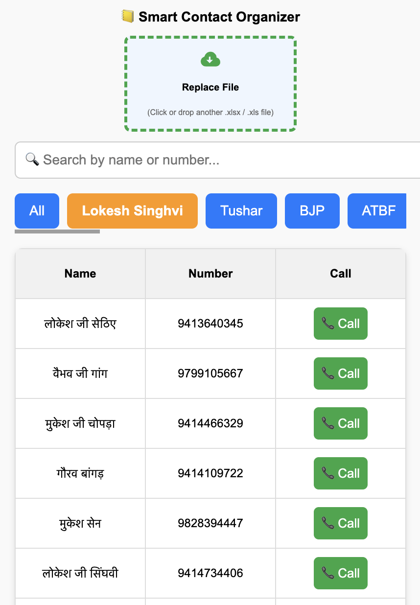

# 📒 Smart Contact Organizer

Smart Contact Organizer is a web application that allows users to upload an **Excel file (.xlsx / .xls)** containing names and phone numbers. The app then organizes the data into searchable, filterable, and callable contact lists.

## ✨ Features

- 📂 **Excel Upload**: Upload `.xlsx` or `.xls` files with **Name** and **Number** columns.  
- 🔍 **Search**: Quickly search contacts by name or number.  
- 📑 **Tabs by Sheet**: Automatically creates tabs for each sheet in the uploaded Excel file.  
- 📞 **Call Button**: Instantly call a contact with a single click.  
- 🔄 **Replace File**: Upload a new file anytime to refresh the contact list.  
- 🎨 **Clean UI**: Simple, responsive interface for both desktop and mobile.  

---

## 🖼️ Screenshot


---

## 🚀 Getting Started

### 1. Clone the Repository
```bash
git clone https://github.com/your-username/smart-contact-organizer.git
cd smart-contact-organizer
```

### 2. Install Dependencies
If you’re using plain HTML/JS:
```bash
No installation needed – open index.html in your browser.
```

If you’re using Node.js + React (adjust if applicable):
```bash
npm install
npm start
```

---

## 📂 File Structure
```
.
├── index.html        # Main entry point
├── assets/           # Images, icons, etc.
├── README.md         # Project documentation
```

---

## 📊 Excel File Format

Your Excel file should have at least the following columns:

| Name           | Number      |
|----------------|-------------|
| John           | 9999999999  |
| Michael        | 8888888888  |

- Extra columns will be ignored.  
- Empty values are handled gracefully.  

---

## 🔧 Tech Stack
- **Frontend**: HTML, CSS, JavaScript  
- **Library**: [SheetJS (xlsx)](https://sheetjs.com/) for Excel parsing  

---

## 📱 Usage
1. Upload an Excel file (`.xlsx` or `.xls`).  
2. Browse contacts under the correct **sheet tab**.  
3. Use the **search bar** to find a name or number.  
4. Click the **Call** button to initiate a call.  

---

## 📌 Future Improvements
- ✅ Export contacts back to Excel/CSV.  
- ✅ Multi-language support.  
- ✅ Contact grouping and tagging.  
- ✅ Save frequently used files locally.  

---

## 🤝 Contributing
Contributions are welcome! Feel free to fork the repo and submit a PR.

---

## 📜 License
This project is licensed under the **MIT License** – free to use and modify.  
